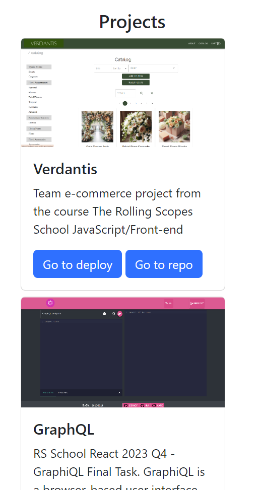

  <a href='https://bootstrap-kate-goncharik.netlify.app'>
    
    
    
    
    <h1 align="center">Simple Bootstrap project</h1>

  </a>

<!-- TABLE OF CONTENTS -->

  
Table of Contents

  <ol>
    <li>
      <a href="#about-the-project">About The Project</a>
      <ul>
        <li><a href="#technology-stack">Technology stack</a></li>
      </ul>
    </li>
    <li>
      <a href="#getting-started">Getting Started</a>
      <ul>
       <li><a href="#installation">Installation</a></li>
      </ul>
    </li>

  </ol>

<!-- ABOUT THE PROJECT -->

## About The Project

### _Simple Bootstrap project_

_Completed: August 2024_

Check out deployment - [at netlify](https://bootstrap-kate-goncharik.netlify.app)

Application is responsive with minimum resolution of 375px and maximum of 1920px.

### Technology stack

[![NPM][NPM]][NPM-url]

[![HTML5][HTML5]][HTML5-url]

[![Netlify][Netlify]][Netlify-url]

(<a href="#readme-top">back to top</a>)

<!-- GETTING STARTED -->

## Getting Started

To get a local copy up and running follow these simple example steps.

### Installation

1. Clone the repo

   sh
   git clone <https://github.com/KateGoncharik/bootstrap.git>

2. Install NPM packages

   sh
   npm install

3. Start local server in VSCode or check out the deployment

(<a href="#readme-top">back to top</a>)

[NPM]: https://img.shields.io/badge/NPM-%23CB3837.svg?style=for-the-badge&logo=npm&logoColor=white
[NPM-url]: https://www.npmjs.com
[HTML5]: https://img.shields.io/badge/html5-%23E34F26.svg?style=for-the-badge&logo=html5&logoColor=white
[HTML5-url]: https://html.com/html5/
[Netlify]: https://img.shields.io/badge/netlify-%23000000.svg?style=for-the-badge&logo=netlify&logoColor=#00C7B7
[Netlify-url]: https://www.netlify.com/
